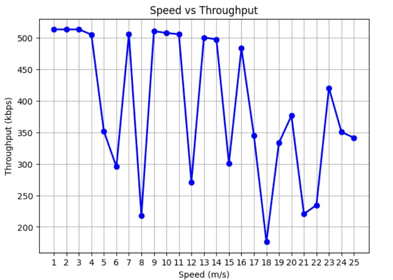
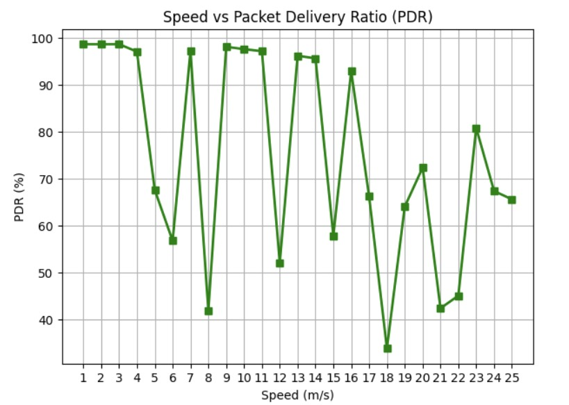
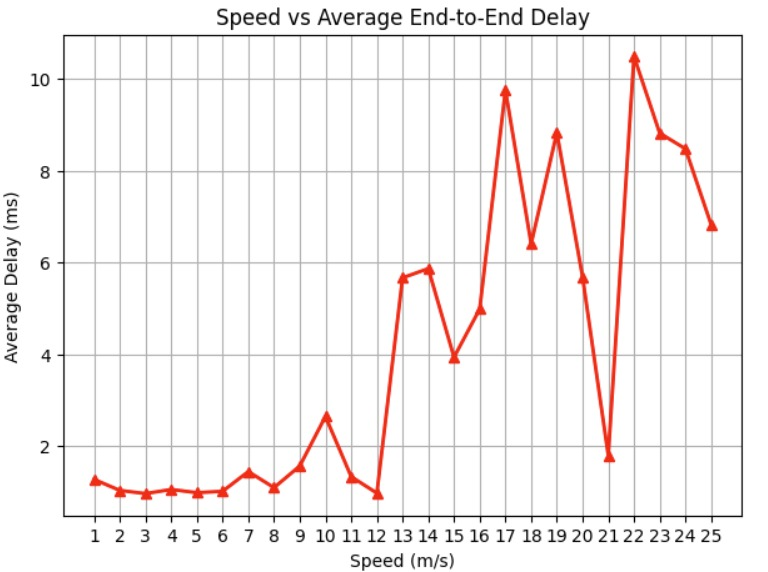
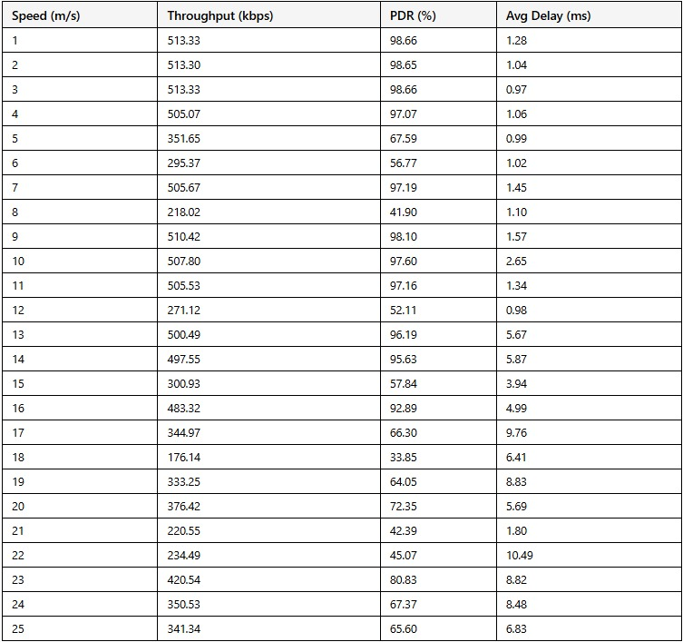

#  Mobility Impact on WiFi and MANET Networks

##  Overview

This project analyzes how node mobility affects network performance in **WiFi** and **Mobile Ad Hoc Networks (MANETs)**.

The study evaluates key performance metrics such as throughput, delay, and packet loss under varying mobility conditions using network simulation.

---

##  Objectives

* Analyze the impact of node mobility on network stability
* Compare performance between WiFi and MANET
* Evaluate key metrics:

  * Throughput
  * End-to-end delay
  * Packet loss

---

##  Technologies Used

* NS2 / NS3 (or your simulator — tell me which one)
* C++ / Python
* Networking protocols (TCP/UDP)

---

## Methodology

* Simulated network environments with varying node mobility
* Configured scenarios for WiFi and MANET
* Collected performance metrics under different conditions
* Compared results across scenarios

---

## Results

* Increased mobility leads to higher packet loss
* MANET adapts better to dynamic environments
* WiFi performance decreases with instability

###  Performance Graphs

---

### 📋 Summary Table

---

## 💡 Key Insights

* Network performance decreases as mobility increases
* MANET performs better in dynamic environments
* Packet loss increases at higher speeds

---

##  Project Structure

* `src/` → simulation scripts
* `results/` → graphs and outputs
* `report/` → detailed analysis

---

## How to Run

1. Install NS2/NS3
2. Run simulation scripts
3. Analyze output data

---

##  Concepts Covered

* Wireless Networks
* MANET
* Network Simulation
* Performance Analysis

---

##  Author

Nikitha Baddam
